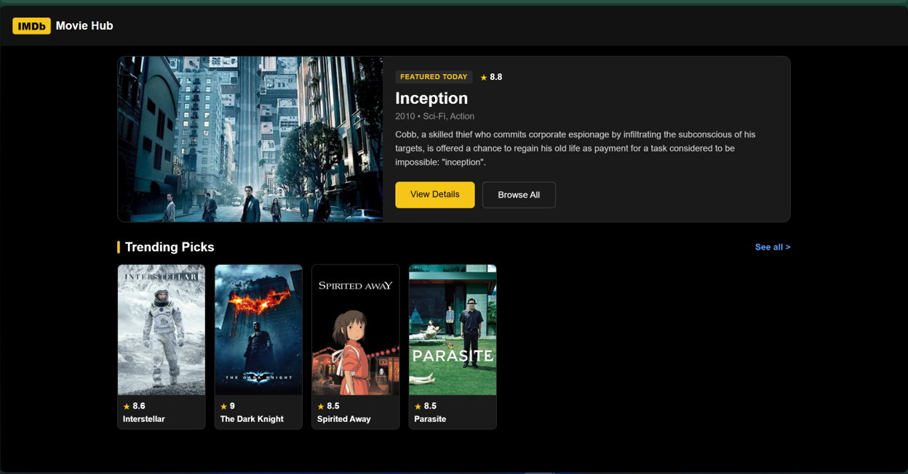
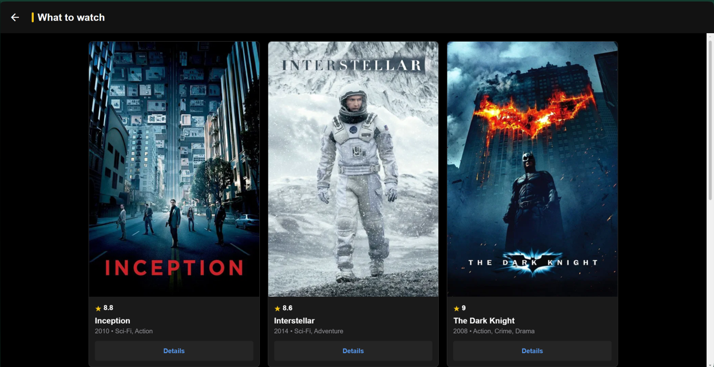
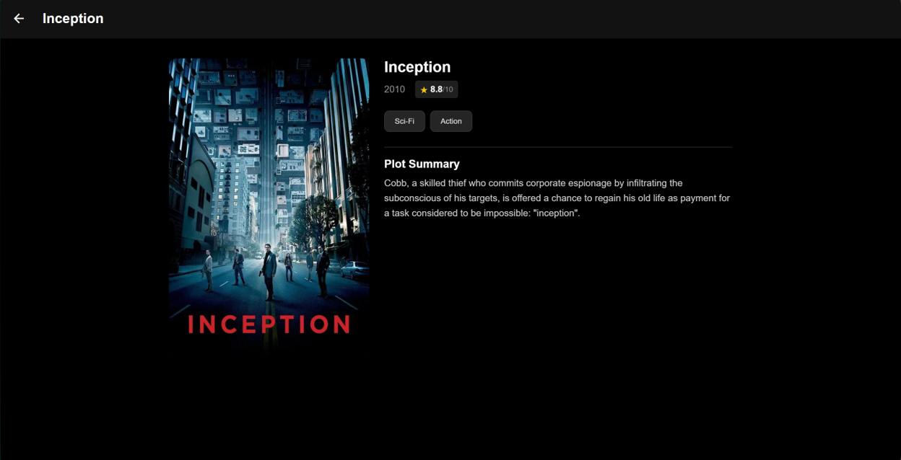

# 🎬 IMDb Movie Hub - React Native Application

A cross-platform movie catalog application inspired by the IMDb design system. Built with React Native, Expo, React Native Paper, and React Navigation.

## 🚀 Key Features

- **Responsive Grid System**: Automatically shifts between a 3-column layout on Desktop/Web viewports and an optimized single/double-column layout on mobile devices.
- **Native Stack Navigation & Deep Linking**: Seamless screen transitions (`Home` ➔ `MovieList` ➔ `Details`) integrated with browser URL history for backward/forward navigation support.
- **Dynamic Parameterized Routes**: Clean separation of concerns passing full entity payloads via `route.params` without hardcoded screen states.
- **Interactive Micro-interactions**: Smooth hover scale animations, custom IMDb star rating badges, and responsive UI components following Material Design 3 guidelines.
- **Decoupled Architecture**: Modular structure separating screen views (`screens/`), reusable presentation components (`components/MovieCard.js`), and centralized datasets (`data/movies.json`).

## 🛠️ Tech Stack

- **Framework**: React Native (Expo SDK)
- **UI Library**: React Native Paper (MD3 Dark Theme)
- **Navigation**: React Navigation (Native Stack)
- **Language**: JavaScript (ES6+)

## 📸 Screenshots

| Home Screen | Movie Catalog | Movie Details |
| :---: | :---: | :---: |
|  |  |  |

*(Note: Place your screen capture images into the `assets/` folder with matching filenames)*

## 💻 Getting Started Locally

1. **Clone the repository:**
   ```bash
   git clone [https://github.com/](https://github.com/)<YOUR-GITHUB-USERNAME>/<YOUR-REPO-NAME>.git
   cd <YOUR-REPO-NAME>
   ```

2. **Install dependencies:**
   ```bash
   npm install
   ```

3. **Start the application:**
   ```bash
   npx expo start
   ```

- Press `w` in the terminal to launch the web browser.
- Scan the displayed QR code with Expo Go on your mobile device.